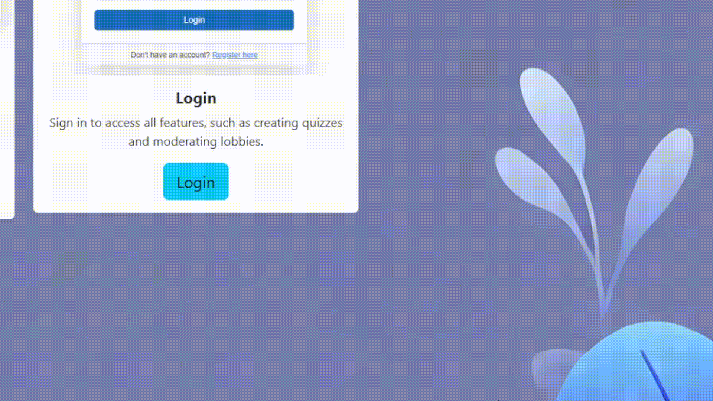
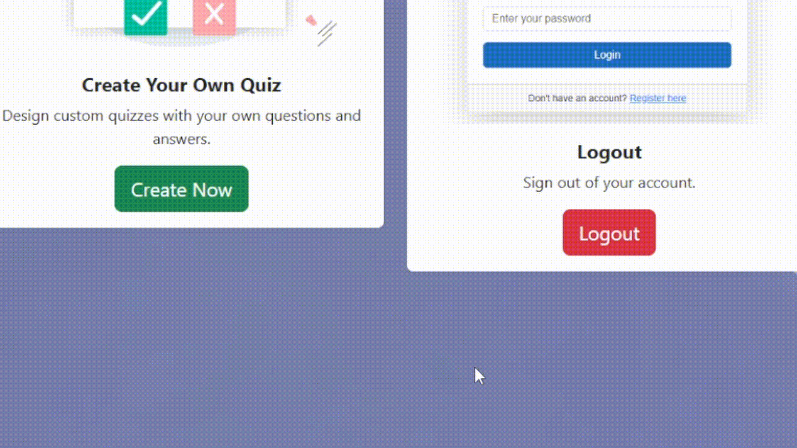
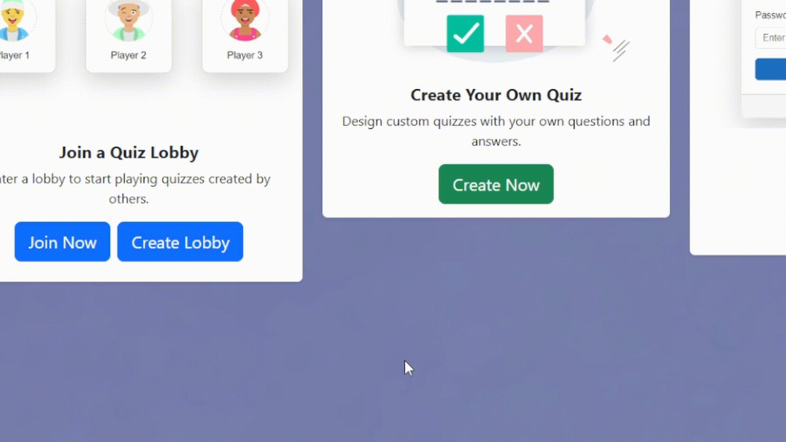
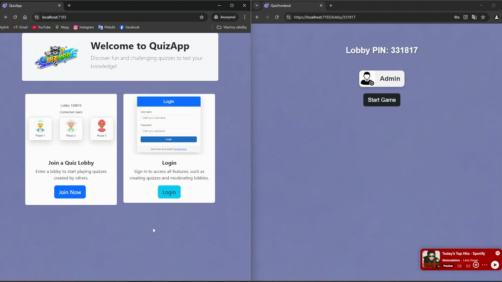
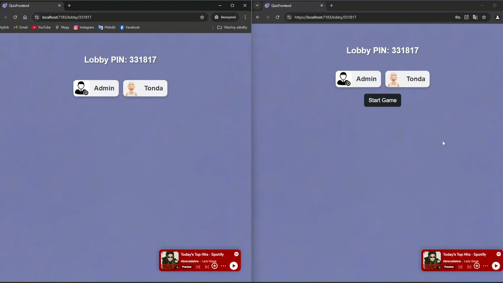
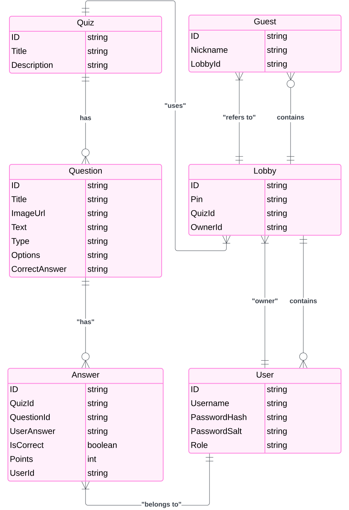

## Vývoj
- Veškeré zdrojové kódy jsou ve složkách QuizApi (backend) a QuizFrontend
- [Katalog požadavků](https://pslib.sharepoint.com/:w:/s/p2021a/Ed5VjzOuqWtFqRbVP0DZfpQBq4TWULvlHUxKFtUMgnk0pw?e=LByOs5)
- [Projektová karta](https://pslib.sharepoint.com/:w:/s/p2021a/Ed5VjzOuqWtFqRbVP0DZfpQBq4TWULvlHUxKFtUMgnk0pw?e=LByOs5)
- [Dokument](https://pslib.sharepoint.com/:w:/s/p2021a/Een2-Usbpb9DkMPERqsvYiMBOMQz5vFvvDewMDAPm_nncw?e=nXNj5e)

## Přihlašování

## Tvorba kvízu

## Vytvoření lobby

## Připojení do lobby

## Spuštění hry

## Databáze
### Služby
- Microsoft Azure SQL Server
- Microsoft Azure SQL Database
### Umístění
Germany West Central
### Databázový diagram
Entity-Relationship diagram pro databázový model

## Real-time komunikace
### Služby
- SignalR
### Umístění
Germany West Central
### Kapacita
Projekt využívá Free_F1 úroveň
- Maximálně počet připojení: 20
- Počet zpárav za den: 20 000
